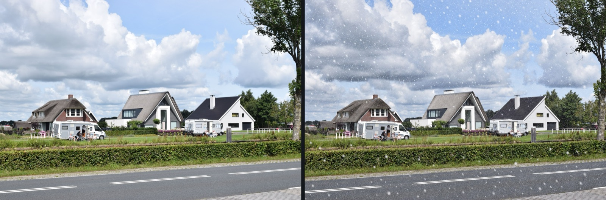
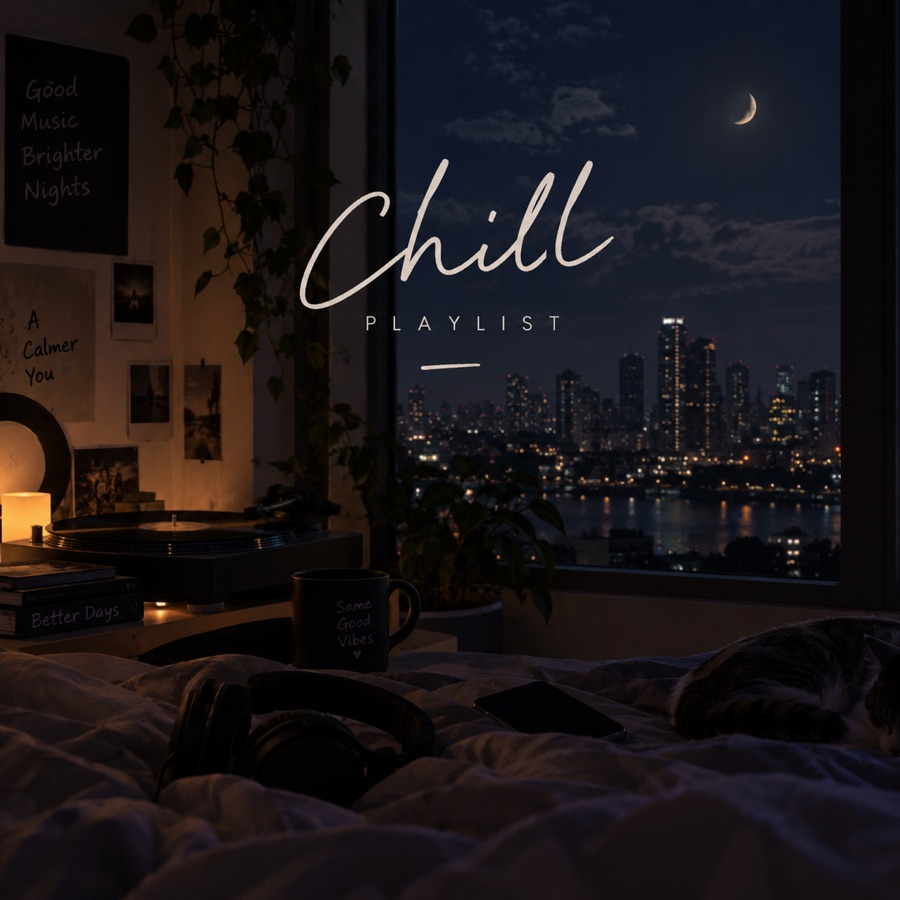
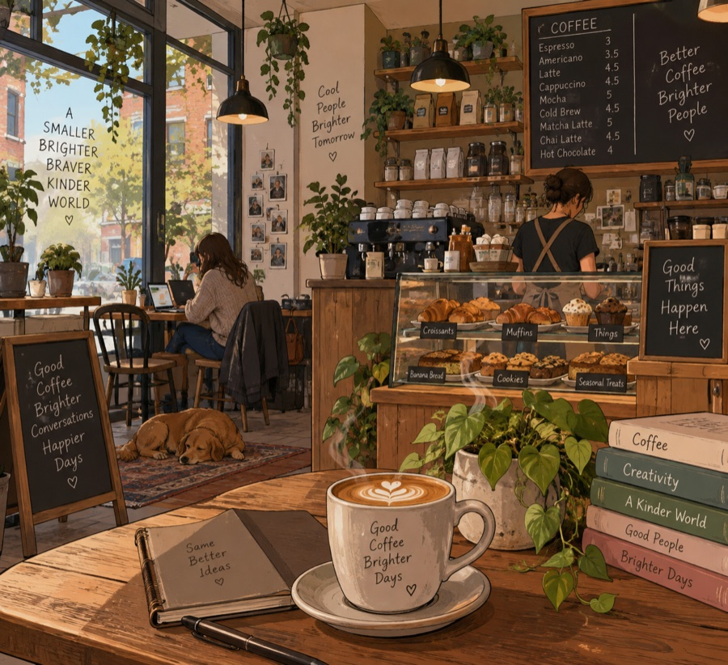
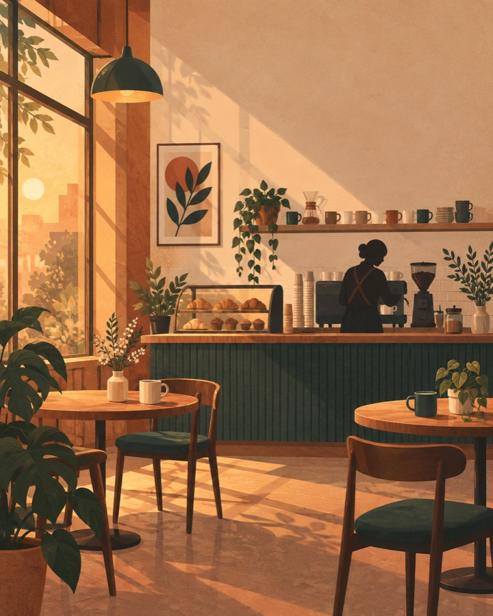
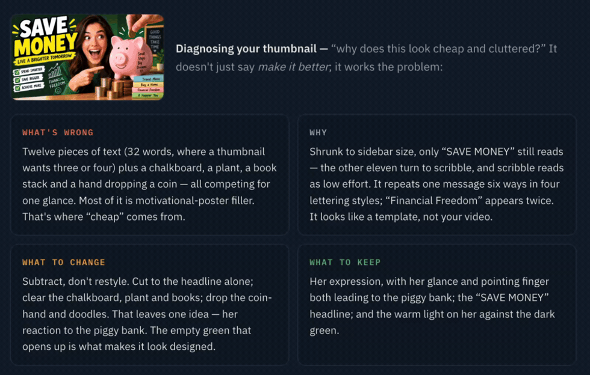
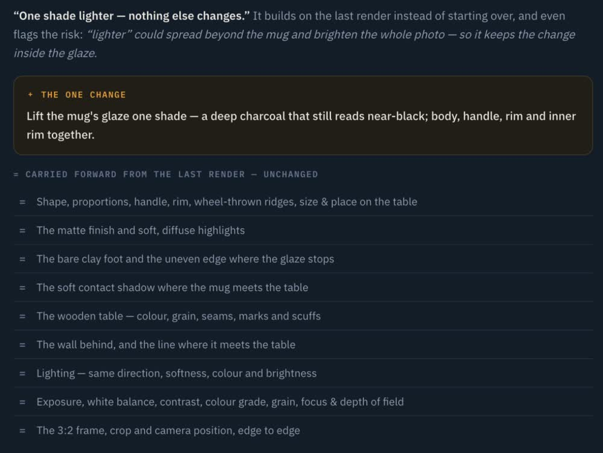

# Visual Director

**Turn a rough idea into a precise, ready-to-paste image-generation prompt — and edit, iterate, and diagnose without breaking what already works.**

Visual Director is a **Claude Skill**: a plain-text bundle you drop into Claude. It writes
*direction* — it does **not** render images itself. You describe what you want; Visual Director
hands you one ready-to-paste block that you take to an image generator (ChatGPT / GPT Image by
default) to actually make the picture.

**Use it with any capable AI.** It installs as a Claude Skill, but it's just plain text — paste
the same bundle into a ChatGPT custom GPT, a Gemini Gem, or any assistant you can give instructions
to. (It's authored and tested with Claude; the direction it writes targets ChatGPT / GPT Image by
default.)

> New here? Go straight to the [Quickstart](#quickstart) — you can produce your first direction
> block in a couple of minutes. Fuller guides live in [`docs/onboarding/`](docs/onboarding/).

---

## What it does

Visual Director is a **renderer-agnostic direction engine**. It works out *how much* effort a
request needs, what to keep versus change, and assembles a single ready-to-paste block. In plain
terms, it does four things:

- **Generate** — turns a vague ask ("moody playlist cover, chill night vibe") into a precise,
  ChatGPT-ready prompt that beats a raw one-liner.
- **Preserve & edit** — when you have an image and want to change one thing ("new background, keep
  the subject identical"), it locks the immutables so the rest doesn't drift.
- **Diagnose** — when a render came out wrong ("why does this thumbnail look cheap?"), it tells you
  what's wrong, why, what to change, and what to keep.
- **Iterate** — treats your follow-up feedback as a *delta* on the last result, not a fresh
  regeneration, so you stop losing ground with every round.

It never renders the image. Its output is always **one delimited block** you paste into your image
generator of choice.

### What it is *not*

- **Not an image renderer.** It produces text direction; the pixels come from ChatGPT / GPT Image,
  Midjourney, Gemini, Ideogram, or FLUX — whichever you paste into.
- **Not a product-photography tool.** Visual Director has **no product-photography preset**.
  E-commerce / product shots are handled by a separate sibling product, **Product Shot Director** —
  not by Visual Director.
- **Not a subscription, and not an integration.** Pro is a one-time purchase (see below). The
  renderer profiles are plain-text reference files inside the bundle — there is **no API, no runtime
  connection, and no code to run**.

---

## Examples

*Same ask, side by side. Left is what a normal prompt gives you; right is Visual Director's block,
pasted straight into ChatGPT / GPT Image — no editing, no retouching.*

**Edit one thing, keep the rest.** *"Add falling snow"* — the houses, campervans, sky and road stay
exactly as they were:



**Iterate without losing ground.** Each round changes only the one thing you name — the table, wall
and light hold steady across all three frames:

<table>
  <tr>
    <th>Original photo</th>
    <th>“make the mug matte black”</th>
    <th>“now add steam”</th>
  </tr>
  <tr>
    <td></td>
    <td></td>
    <td></td>
  </tr>
</table>

**A vague prompt vs. a directed one — a playlist cover.** The one-liner bakes in text you can't use;
the directed block renders **no text** and keeps the frame title-safe:

<table>
  <tr>
    <th>“chill playlist cover, night vibe”</th>
    <th>Visual Director’s block</th>
  </tr>
  <tr>
    <td></td>
    <td></td>
  </tr>
</table>

**Not everything is a cinematic photo — a flat illustration.** The one-liner fills the frame with
garbled text; the block states the idiom, a limited palette, and clear space for a title:

<table>
  <tr>
    <th>“cozy indie coffee shop, illustration”</th>
    <th>Visual Director’s block</th>
  </tr>
  <tr>
    <td></td>
    <td></td>
  </tr>
</table>

**A YouTube thumbnail.** The one-liner is a cluttered, text-covered mess; the directed block is one
bold subject with clean space for your own headline — and no baked-in text:

<table>
  <tr>
    <th>“youtube thumbnail about saving money, eye catching”</th>
    <th>Visual Director’s block</th>
  </tr>
  <tr>
    <td></td>
    <td></td>
  </tr>
</table>

### It doesn't just generate — it reasons

Free tools hand you an image and hide the thinking. Ask Visual Director *why* a render is off and it
works the problem — what's wrong, why, what to change, and what to keep:



And when you make a follow-up edit, it treats your tweak as a **delta** — changing the one line you
named and carrying everything else forward, unchanged:



---

> It writes the direction; the renderer renders. Every image above came out of ChatGPT / GPT Image
> from Visual Director's block — the difference is the direction, not a better model.

---

## Lite and Pro

Visual Director ships as two bundles. **Lite is free; Pro is a one-time US$19 purchase that
includes ongoing update access — not a subscription.** The headline promise is that it
**stays working as the models change**: the preservation, critique and iteration reasoning does not
decay when a renderer updates, and the renderer profiles are kept current.

| | **Lite** (free) | **Pro** (one-time $19 + updates) |
|---|---|---|
| Complexity triage + universal specificity taxonomy | ✅ | ✅ |
| Generate-from-scratch direction | ✅ | ✅ |
| **Cover / series-art preset** | ✅ (the free hook) | ✅ |
| ChatGPT / GPT Image profile | ✅ | ✅ |
| Basic critique (top 1–2 issues) | ✅ | ✅ |
| Preservation **awareness** (flags mutable/immutable, warns of collateral change) | ✅ | ✅ |
| Onboarding + consumer-safety behaviour | ✅ | ✅ |
| **Full preservation system** (constraint extraction + continuity) | — | ✅ |
| **Iterative edit-state ledger** (ORIGINAL → EDIT → feedback as deltas) | — | ✅ |
| **Precise single-element edits** without regenerating the rest | — | ✅ |
| **Deep failure diagnosis** (what / why / change / keep) | — | ✅ |
| Thumbnail + illustration presets | — | ✅ |
| Midjourney, Gemini, Ideogram, FLUX profiles (*improve with use*) | — | ✅ |
| User-authored character/series memory · artifact-repair guidance | — | ✅ |

**The line:** Lite makes *one good image well* (and notices preservation). Pro is *edit precisely,
iterate without breaking it, and diagnose failures* — plus the revenue presets.
**[Get Visual Director Pro — $19](https://meridianadmin8.gumroad.com/l/visual-director-pro?utm_source=lite-readme).**

---

## Install

Visual Director is a Claude Skill — a folder of plain-text files, no dependencies to build and
nothing to compile. Installing it means putting that folder where Claude looks for skills.

1. **Get the bundle folder.** Lite (free) is the `visual-director` folder in this repo. **Pro**
   ($19, one-time) is a purchase from [Gumroad](https://meridianadmin8.gumroad.com/l/visual-director-pro?utm_source=lite-readme)
   — you download the `visual-director-pro` folder there.
2. **Copy it into your Claude skills directory:**
   - Personal (all your projects): `~/.claude/skills/`
   - Project-scoped (one repo): `<your-project>/.claude/skills/`

   So a Pro install lands at, e.g., `~/.claude/skills/visual-director-pro/SKILL.md`.
3. **Restart / reopen Claude** so it picks up the new skill.
4. **Confirm it loaded** by asking Claude: *"Do you have a visual-director skill available?"*

That's the whole install — there are no API keys, no accounts, and no services to connect. Full
per-environment notes are in [`docs/onboarding/install.md`](docs/onboarding/install.md).

---

## Quickstart

**Goal: produce your first ready-to-paste direction block.** No prior context needed.

1. Install the skill (above) and reopen Claude.
2. Ask Claude, in plain words, for a cover:

   > *Make a chill playlist cover, night vibe.*

3. Visual Director stays in scale for a simple ask — it fills the key axes, states its assumptions
   out loud, asks at most a question or two, and **invents no person you didn't describe**. You'll
   get a short note followed by one delimited block, something like:

   ```
   A calm, moody nighttime photograph for a chill playlist cover. A quiet empty street
   after dark: warm amber streetlight pooling low in the frame against cool, deep-blue
   night air. Full dark sky, no dusk or blue-hour glow. A few scattered warm-lit windows
   far in the background, softly out of focus, spaced apart so they never compete with
   the foreground. Soft, hazy, relaxed atmosphere.

   Focal weight upper-centre; keep the lower third low-contrast and uncluttered for a
   title later — render no text. Square 1:1 aspect ratio, edge-to-edge full bleed, no
   border, no frame.

   (Renderer unspecified → targeting ChatGPT. Medium is a proposed default — say the word
   to switch to illustration/painting. No person included by default.)
   ```

4. **Copy the block** (everything inside the fence) and paste it into ChatGPT / GPT Image to render.
5. **Want a person on it?** *You* describe them — Visual Director will never supply an appearance you
   didn't author. For example: *"Add the subject: a woman with close-cropped silver hair, a dark
   green field jacket, mid-30s."* It folds your description in verbatim.

That's a complete first run. The step-by-step walkthrough — including editing an existing image and
building a consistent series — is in [`docs/onboarding/quickstart.md`](docs/onboarding/quickstart.md).

---

## Renderer guide

You paste Visual Director's block into an image generator. Each supported generator has a **renderer
profile** — a plain-text file inside the bundle that adjusts only *how the finished block is phrased*
for that model.

**Tuned for ChatGPT / GPT Image** — the default and the renderer of record. If you name no renderer,
the block targets ChatGPT / GPT Image and says so in one line.

**Midjourney, Google Gemini, Ideogram and FLUX** (Pro) are included as **starting points that improve
with use** — each documented from that model's public behaviour and refined as real quirks are
confirmed. An honest head start, not a claim of verified behaviour.

| Renderer | Bundle |
|---|---|
| **ChatGPT / GPT Image** (default) | Lite + Pro |
| Midjourney · Google Gemini · Ideogram · FLUX | Pro |

These five are the only supported renderers; the profiles are plain text, with no API or runtime
connection. Full details are in [`docs/onboarding/renderer-guide.md`](docs/onboarding/renderer-guide.md).

---

## Troubleshooting

| Symptom | Likely cause / fix |
|---|---|
| Claude doesn't seem to use the skill | Check the folder is under `.claude/skills/` and reopen Claude. Ask it to list available skills. |
| It asked me to describe a person before continuing | Working as intended — it ships **no** built-in human appearance and won't invent one (D-001). Describe the subject yourself. |
| Output came split across prose | Ask for "the block only". The contract is always one delimited, ready-to-paste block; notes go before it. |
| My night scene renders as dusk / blue hour | Keep the "full dark, no ambient sky" wording in the block; that phrasing exists to stop the drift. |
| I want product / e-commerce shots | Visual Director has no product-photography preset. That's a separate sibling product, **Product Shot Director**. |
| I named Midjourney/Gemini/Ideogram/FLUX and results are uneven | Those profiles (Pro) are starting points that improve with use. ChatGPT / GPT Image is the tuned default. |

More in [`docs/onboarding/troubleshooting.md`](docs/onboarding/troubleshooting.md).

---

## Documentation

- [`docs/onboarding/`](docs/onboarding/) — install, quickstart, renderer guide, troubleshooting
- **Get Pro ($19 · one-time + updates):** [meridianadmin8.gumroad.com/l/visual-director-pro](https://meridianadmin8.gumroad.com/l/visual-director-pro?utm_source=lite-readme)
